# Cursor Motion Blur
This is a Chrome extension that adds motion blur to your cursor. 
This implementation is nowhere near optimal, so contribution to make this a better extension is very well appreciated. 
If you want, you can even fork this repository and make your own implementation.

 

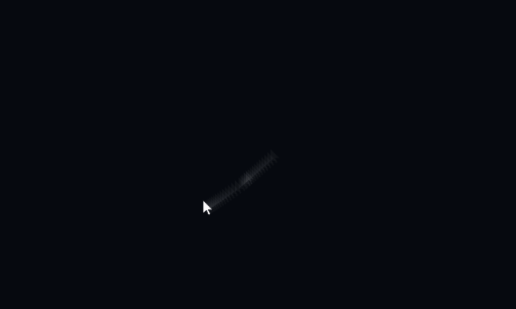

[Installation](#installation) 
[Options](#options)
- [Cursor width](#cursor-width)
- [Opacity](#opacity)
- [Samples](#samples)
- [Delay](#delay)
- [Duration](#duration)
- [Hide real cursor](#hide-real-cursor)
- [Force hide real cursor](#force-hide-real-cursor)

[Error Messages](#error-messages)
- [XXXXX must be an image](#xxxxx-must-be-an-image)
- [XXXXX must be a float](#xxxxx-must-be-a-float)
- [XXXXX must be an integer](#xxxxx-must-be-an-integer)
- [XXXXX is too large](#xxxxx-is-too-large)
- [XXXXX is too small](#xxxxx-is-too-small)
- [QUOTA_BYTES_PER_ITEM quota exceeded](#quota_bytes_per_item-quota-exceeded)

# Installation
This extension has been published to [Chrome Web Store](https://chrome.google.com/webstore/detail/cursor-motion-blur/afehkdebfodlbdmohfkiocgjehoendfd)

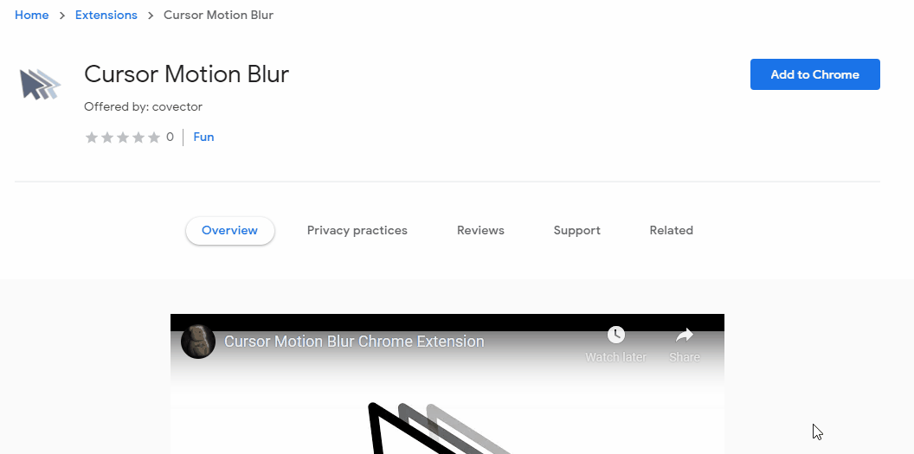

After installing the extension, you can activate the extension by clicking it in the Extensions menu. You will see either "ON" or "OFF" on the icon, it indicates whether the extension is activated or not. Clicking the extension will toggle it on or off.

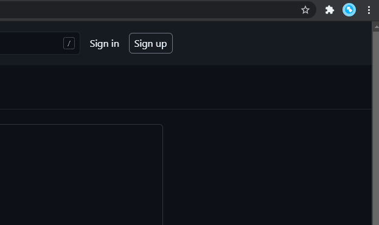

After you enabled it, refresh a webpage and the motion blur effect will be present.

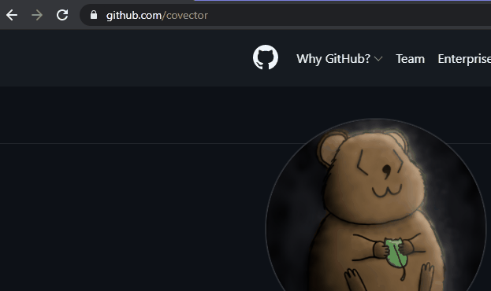

# Options
Go to the options page by selecting "Options" in the 3-dots menu from the Extensions menu. In the following, the options will be explained one by one.

## Cursor image
The image (this "image" refers to the multimedia image) for the images (this "image refers to the translucent fake cursors behind the real cursor) trailing behind. Default to an image of Windows default white cursor (12 x 19 pixel).

Note that the top left hand corner of the image (multimedia) is aligned with the mouse position.

**WARNING: DO NOT USE AN IMAGE THAT IS TOO LARGE, AS IT WILL LAG AND ALSO MAY BE ABLE TO BE SAVED INTO STORAGE**

**Example:** 
Cursor image is set to png of a white dot

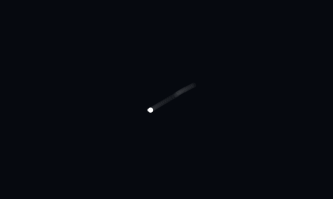

## Cursor width
The width of the images, only accepts css unit (px, em, vh...). Default to 12.5vh, vh is used because it is independent of browser zoom (100vh means the whole webpage's height, so 12.5vh means 12.5% of the whole webpage's height), but you can also use other units like px.

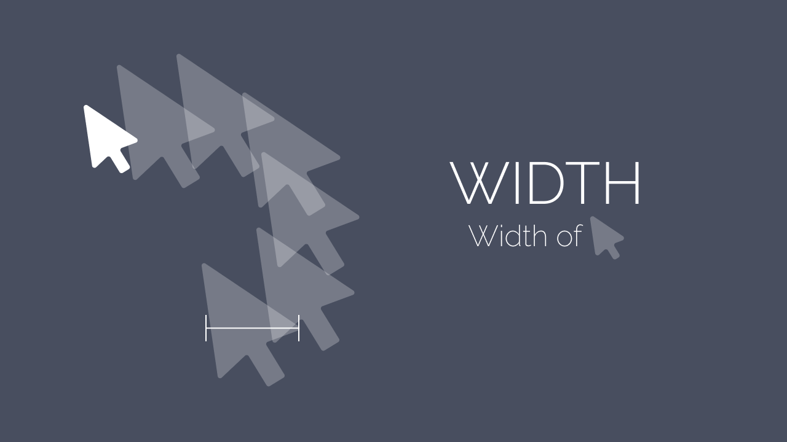

**Example:** 
Cursor width is set to 30px

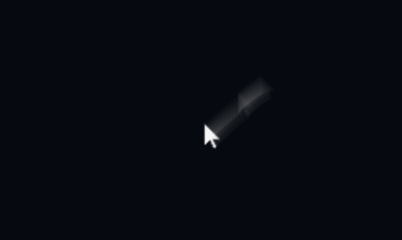

## Opacity
Opacity of the images trailing behind the cursor, must be between 0 to 1 (0 means fully transparent, 1 means fully opaque). Default to 0.04.

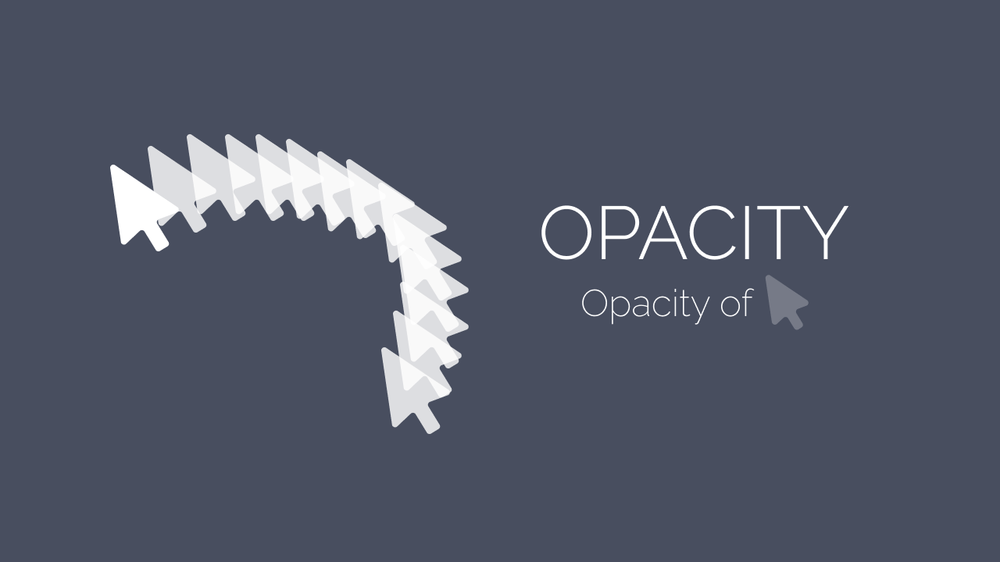

**Example:** 
Opacity is set to 0.5

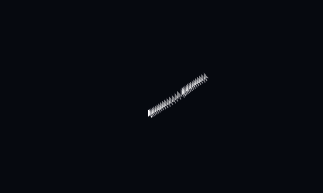

## Samples
Number of the images trailing behind the cursor, must be an integer. Default to 32, be careful not to set too high as it may lag.

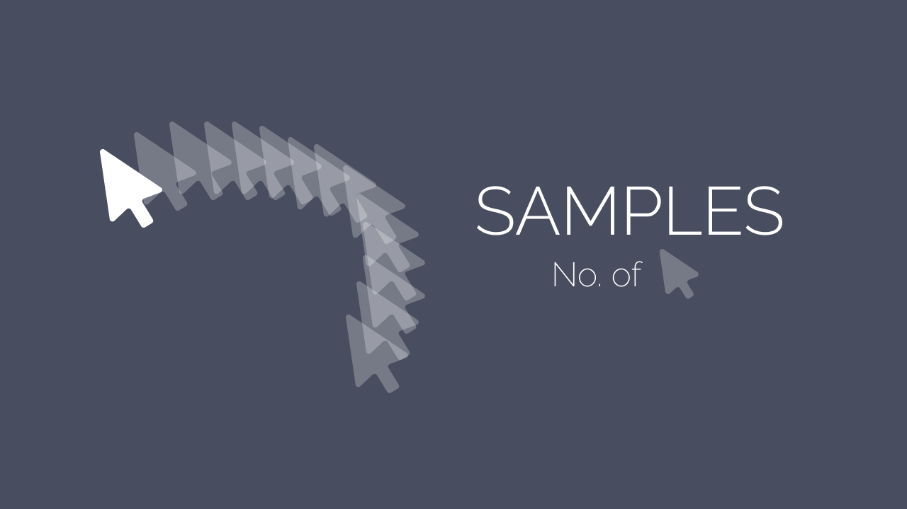

The higher the value, the longer the trail will be. However, it is not recommended to use this option for adjusting trail length, you should consider tuning the "Delay" option instead.

**Example:** 
Samples is set to 128

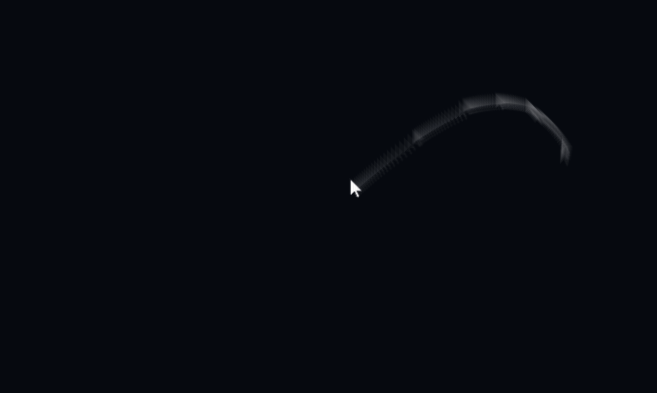

## Delay
The delay between each images trailing behind the cursor. Default to 0.001.

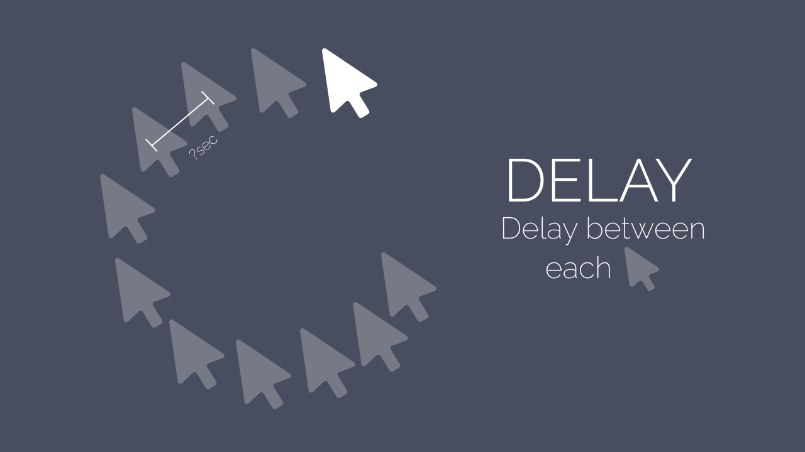

This is for controlling the spacing between images, or the length of the trail. The higher the value, the longer the motion blur trail.

**Example:** 
Delay is set to 0.01

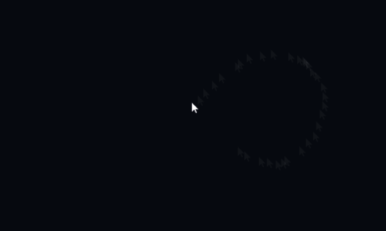

## Duration
Control how fast the first image will move to the cursor, the higher this value, the slower it is. Default to 0.05, when set too high, the last few image will start to act strange (see example).

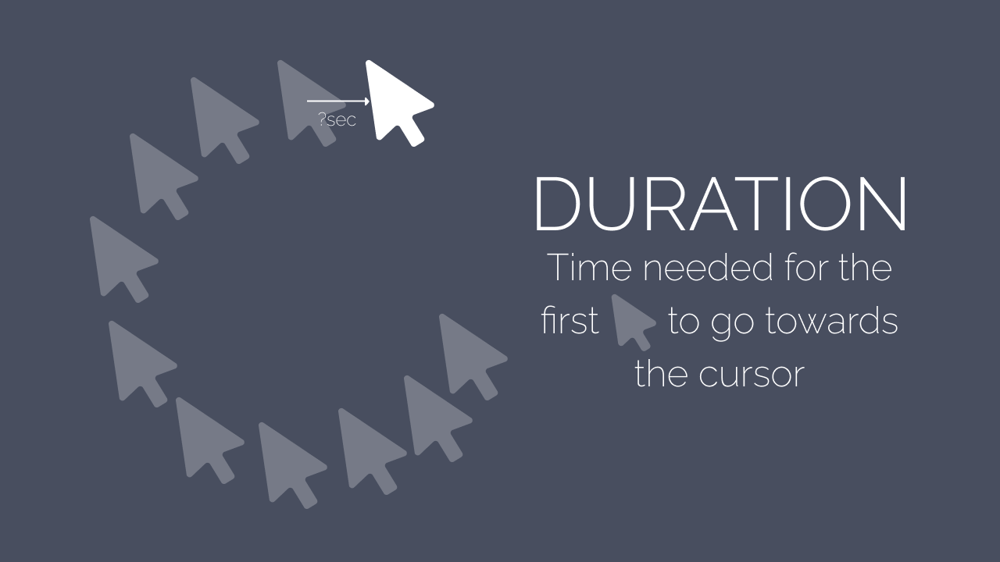

The reason why it acts strangely is that: at any given moment, the first image will get the current mouse position, and then initiate an animation of moving towards it. If the animation duration is too long, which is what this option actually is, the animations will be cut off very often, and it will deviate from the real cursor's path. 
So normally you wouldn't want to change this value.

**Example:** 
Duration is set to 0.1

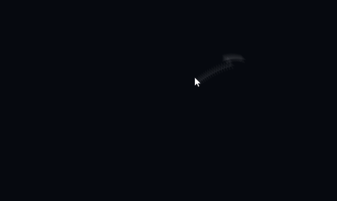

## Hide real cursor
Whether to hide the real cursor and pretend the first image is the actual cursor. When this is checked, the motion blur effect will look better but there will be some mouse movement delay. When this is unchecked, the images will lag behind a bit (see example), but there will not be any movement delay. Default to true.

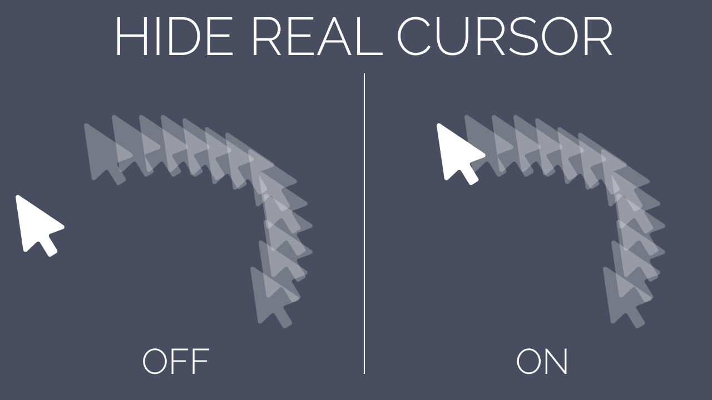

It is impossible to make the images follow the real cursor very closely, there is always a gap between them. What this option does is hiding the real cursor, and making the first image look like the real cursor. However, this in turn creates a movement delay because your real mouse position is not at the first image, but the hidden cursor.

**Example:** 
Hide real cursor set to false

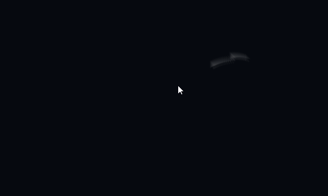

## Force hide real cursor
Whether to also hide the real cursor when the cursor type is set to other thing, e.g. when hovering a button. This option only takes effect if Hide real cursor is checked. If this is unchecked, there may be inconsistency between cursor and the trailing images. Default to true.

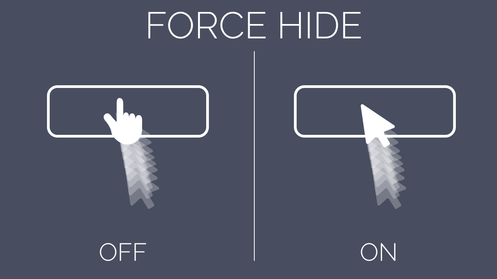

When this option is not enabled, as the cursor hover a button, the setting that hides the real cursor was overrided by one that sets the cursor to a pointer. What this option does is overriding that setting once more. 

**Example:** 
Force hide real cursor set to false while Hide real cursor set to true. The arrow cursor is actually an image pretending to be the real cursor, while the pointer cursor is the real cursor. The real cursor is hidden only when the cursor type is arrow.

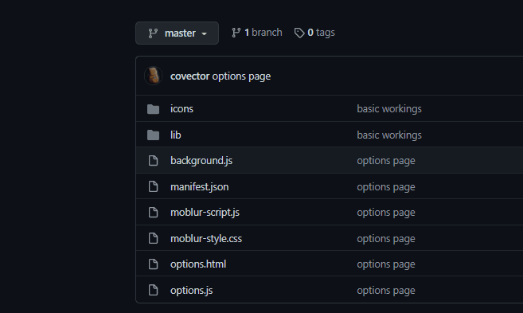

# Error Messages
This section is about how to interpret error messages in the option page.
## XXXXX must be an image
You have supplied a non-image file in the Cursor image option.

## XXXXX must be a float
You have supplied something that cannot be converted into a number using the [parseFloat](https://developer.mozilla.org/en-US/docs/Web/JavaScript/Reference/Global_Objects/parseFloat) function.

## XXXXX must be an integer
You have supplied something that cannot be converted into an integer using the [parseInt](https://developer.mozilla.org/en-US/docs/Web/JavaScript/Reference/Global_Objects/parseInt) function.

## XXXXX is too large
You have supplied a number that is too big.

## XXXXX is too small
You have supplied a number that is too small.

## QUOTA_BYTES_PER_ITEM quota exceeded
The image file you supplied in the Cursor image option is too large in size. The default cursor image is only 12 x 19 in pixel.
