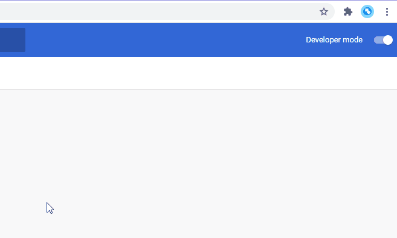
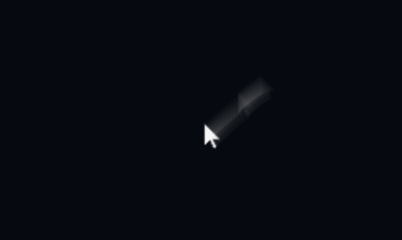
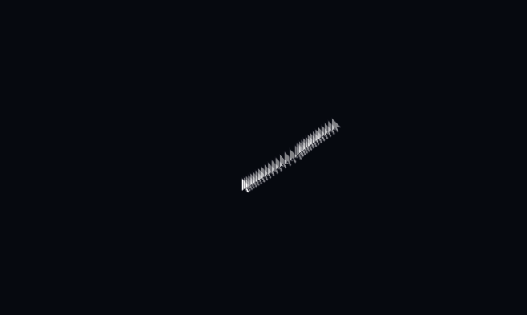
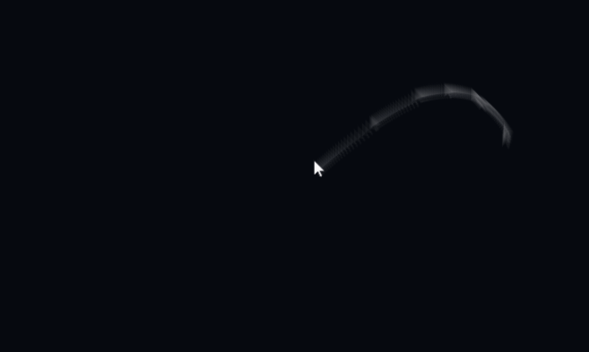
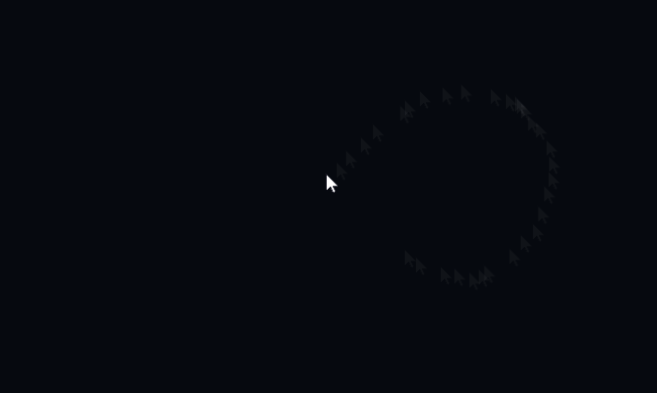
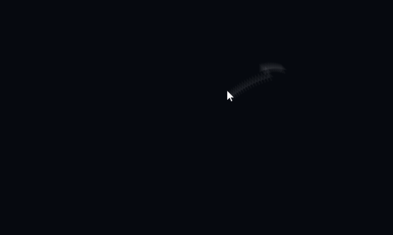
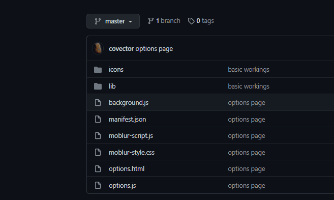

# Cursor Motion Blur
This is a Chrome extension that adds motion blur to your cursor.

[Options](#options)
- [Cursor width](#cursor-width)
- [Opacity](#opacity)
- [Samples](#samples)
- [Delay](#delay)
- [Duration](#duration)
- [Hide real cursor](#hide-real-cursor)
- [Force hide real cursor](#force-hide-real-cursor)

[Error Messages](#error-messages)
- [XXXXX must be an image](#xxxxx-must-be-an-image)
- [XXXXX must be a float](#xxxxx-must-be-a-float)
- [XXXXX must be an integer](#xxxxx-must-be-an-integer)
- [XXXXX is too large](#xxxxx-is-too-large)
- [XXXXX is too small](#xxxxx-is-too-small)
- [QUOTA_BYTES_PER_ITEM quota exceeded](#quota_bytes_per_item-quota-exceeded)

# Options
Go to the options page by right clicking the icon and click "Options". This section is about what each of the option does.

## Cursor image
The image of the blurred cursor. Default to Windows default white cursor.

**Example:** 
Cursor image is set to png of a white dot

## Cursor width
The width of the cursor, only accepts css unit. Default to 12.5vh, vh is used because it is independent of browser zoom, but you can also use other units like px.

**Example:** 
Cursor width is set to 30px

## Opacity
Opacity of the image trailing behind the cursor, must be between 0 to 1. Default to 0.04.

**Example:** 
Opacity is set to 0.5

## Samples
Number of the image trailing behind the cursor, must be integer. Default to 32, be careful not to set too high as it may lag.

**Example:** 
Samples is set to 128

## Delay
The spacing between each images trailing behind the cursor. Default to 0.001.

**Example:** 
Delay is set to 0.01

## Duration
Control how fast the image will move to the cursor, the higher this value, the slower it is. Default to 0.05, when set too high, the last few image will start to act strange (see example).

**Example:** 
Duration is set to 0.1

## Hide real cursor
Whether to hide the real cursor and pretend the first image is the actual cursor. When this is checked, the motion blur effect will look better but there will be some mouse input delay. When this is unchecked, the images will lag behind a bit (see example), but there will not be input delay. Default to true.

**Example:** 
Hide real cursor set to false

## Force hide real cursor
Whether to also hide the real cursor when the cursor type is set to other thing, e.g. hovering a button. This option only takes effect if Hide real cursor is checked. If this is unchecked, there may be inconsistency between cursor and the trailing images. Default to true.

**Example:** 
Force hide real cursor set to false while Hide real cursor set to true. The arrow cursor is actually an image pretending to be the real cursor, while the pointer cursor is the real cursor. The real cursor is hidden only when the cursor type is arrow.

# Error Messages
This section is about how to interpret error messages in the option page.
## XXXXX must be an image
You have supplied a non-image file in the Cursor image option.

## XXXXX must be a float
You have supplied something that cannot be converted into a number using the [parseFloat](https://developer.mozilla.org/en-US/docs/Web/JavaScript/Reference/Global_Objects/parseFloat) function.

## XXXXX must be an integer
You have supplied something that cannot be converted into an intger using the [parseInt](https://developer.mozilla.org/en-US/docs/Web/JavaScript/Reference/Global_Objects/parseInt) function.

## XXXXX is too large
You have supplied a number that is too big.

## XXXXX is too small
You have supplied a number that is too small.

## QUOTA_BYTES_PER_ITEM quota exceeded
The image file you supplied in the Cursor image option is too large in size. The default cursor image is only 12 x 19 in pixel.
